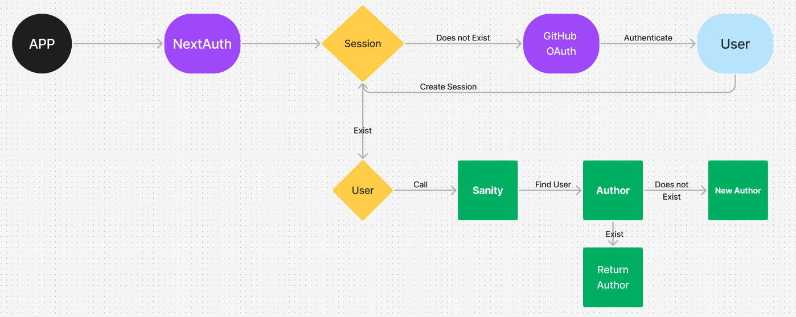

# pitch-portal

This is a [Next.js](https://nextjs.org) project bootstrapped with [`create-next-app`](https://nextjs.org/docs/app/api-reference/cli/create-next-app).

## Getting Started

First, run the development server:

```bash
npm run dev
```

Open [http://localhost:3000](http://localhost:3000) with your browser to see the result.

You can start editing the page by modifying `app/page.tsx`. The page auto-updates as you edit the file.

# Steps

## Auth with NextAuth

At the root of the project, create an file called `auth.ts`

```
import NextAuth from "next-auth";
import Github from "next-auth/providers/github";

export const { handlers, signIn, signOut, auth } = NextAuth({
  providers: [Github],
});
```

Add handlers in `app/api/auth/[...nextauth]/route.ts`

```
import { handlers } from "@/auth";

export const {GET, POST} = handlers
```

import the functions in your projects and get the `session` object

```
import { auth, signIn, signOut } from "@/auth";

const session = await auth();
```

## Theming and Fonts

Add custom themes to the `tailwing.config` file.

For fonts, add `ttf`files to the `fonts`folder. Then in the root layout file, add the newly imported fonts to the `localFont` object and give it a variable name

```
const workSans = localFont({
  src: [
    {
      path: "./fonts/WorkSans-Bold.ttf",
      weight: "700",
      style: "normal",
    },
    {
      path: "./fonts/WorkSans-Regular.ttf",
      weight: "400",
      style: "normal",
    },
  ],
  variable: "--font-work-sans",
});

```

## Utility classes

In the `global.css` file, you can add the `@layer utilities` directive and create custom CSS classes using Tailwind

```css
@layer utilities {
  .heading {
    @apply uppercase bg-black px-6 py-3 font-work-sans;
  }
}
```

## Sanity

With Sanity, you can leverage their APIs to build a whole OS around the content. Sanity integrates very well with Next.js

### Setup

run this cmd to initialize the project with the CLI

```bash
npm create sanity@latest -- --project [projectID] --dataset production --template clean
```

### Studio

To enter the studio add `/studio` to the url

### Workflow



### Schema

Inside `sanity/schemaTypes` folder, create new files called `author.ts` and `startup.ts` and add the following declaration

```javascript
import { UserIcon } from "lucide-react";
import { defineField, defineType } from "sanity";

export const author = defineType({
  name: "author",
  title: "Author",
  type: "document",
  icon: UserIcon,
  fields: [
    defineField({
      name: "id",
      type: "number",
    }),
    defineField({
      name: "name",
      type: "string",
    }),
  ],
  preview: {
    select: {
      title: '"name',
    },
  },
});
```

```javascript
export const startup = defineType({
  name: "startup",
  title: "Startup",
  type: "document",
  fields: [
    defineField({
      name: "title",
      type: "string",
    }),
    defineField({
      name: "slug",
      type: "slug",
      options: {
        source: "title",
      },
    }),
    defineField({
      name: "author",
      type: "reference",
      to: { type: "author" },
    }),
    defineField({
      name: "category",
      type: "string",
      validation: (Rule) =>
        Rule.min(1).max(20).required().error("Please enter a categoty"),
    }),
    defineField({
      name: "image",
      type: "url",
      validation: (Rule) => Rule.required(),
    }),
  ],
});
```

Add the schema name to the `types` array in the `sanity/schemaTypes/index.ts` file

## Sanity Data

To get Sanity data, you must use GROQ (Sanity's own query language)

### Queries

Create a `queries.ts` in the `sanity/lib` folder.

This GROQ query below fetches startup documents from Sanity, optionally filters them based on a search term (matching against title, category, or author name), orders them by creation date, and returns specified fields including author details.

```javascript
import { defineQuery } from "next-sanity";

export const STARTUPS_QUERY = defineQuery(`
    *[_type == "startup" && defined(slug.current) && !defined($search) 
    
    || title match $search 
    || category match $search 
    || author-> name match $search] 
    
    | order(_createdAt desc) {
        _id, 
        title,
        slug,
        _createdAt,
        views,
        description,
        category,
        image,
        author -> {
            _id, name, image, bio
        }
}`);
```

### READ Data

```javascript
import { client } from "@/sanity/lib/client";
import { STARTUPS_QUERY } from "@/sanity/lib/queries";

const posts = await client.fetch(STARTUPS_QUERY);
```

### WRITE Data

- Create a token in Sanity API and add to env as `SANITY_WRITE_TOKEN`
- Create a `write-client.ts` file in `sanity/lib/`

```javascript
import "server-only";
import { createClient } from "next-sanity";

import { apiVersion, dataset, projectId, token } from "../env";

export const writeClient = createClient({
  projectId,
  dataset,
  apiVersion,
  token,
  useCdn: true, // Set to false if statically generating pages, using ISR or tag-based revalidation
});

if (!writeClient.config().token) {
  throw new Error("Write token not found");
}
```

- Page

```javascript
await writeClient
  .patch(id)
  .set({ views: totalViews + 1 })
  .commit();
```

### unstable_after

`unstable_after` is an experimental Next.js function that allows to schedule work to be executed after a response or pre-render is completed. In this case, the total of views should only increment after receiving the most up-to-date total from Sanity

## Sanity Type Generation

Run this command to extract types from Schemas and to create a `sanity/extract.json` file

```bash
npx sanity@latest schema extract --path=./sanity/extract.json
```

Create a `sanity-typegen.json` file at the root and add following config object

```bash
{
  "path": "./src/**/*.{ts,tsx,js,jsx}",
  "schema": "./sanity/extract.json",
  "generates": "./sanity/types.ts"
}
```

Now run this command to create a `type.ts` file and generate types from the schemas

```bash
npx sanity@latest typegen generate
```

To automise the creation of the types each time we add, delete or update the schemas, you can run the command `npx run typegen` after adding new scripts

```javascript
  "predev": "npm run typegen",
  "prebuild": "npm run typegen",
  "typegen": "sanity schema extract --path=./sanity/extract.json && sanity typegen generate"
```

## Cache and Live API

### ISR

Incremental Static Regeneration (ISR) in Next.js fetches and caches data by default, serving cached data for requests within a set revalidation period (e.g., 60 seconds) and re-fetching data from the source if the cached data becomes stale after this period.

### Live Content API

With the Live Content API the application can respond instantly to changes, serving up-to-date content to all users

```javascript
import { client } from "@/sanity/client";
import { defineLive } from "next-sanity";

const { sanityFetch, SanityLive } = defineLive({ client });

export default async function Page() {
  const { data: products } = await sanityFetch({ query: PRODUCTS_QUERY });

  return (
    <section>
      {products.map((product) => (
        <article key={product._id}>
          <a href={`/product/${product.slug}`}>{product.title}</a>
        </article>
      ))}
      <SanityLive />
    </section>
  );
}
```

## Partial Pre Rendering (PPR)

PPR combines static and dynamic components in the same route
[Experimental - wait for ready to production release before integration]

## Create Startup

### Form

`useActionState` is an experimental hook that aims at replacing `useFormState` and that allows you to update state based on the result of a form action.

```javascript
const [state, formAction, isPending] = useActionState(fn, initialState, permalink?);
```

Caveat > `useActionState` by defaut will reset forms when Encountering any errors. A strategy is needed to save the client side calues somehow, ie local storage, etc

## Concepts

### Server Actions

Server Actions are asynchronous functions that are executed on the server. They can be called in Server and Client Components to handle form submissions and data mutations in Next.js applications.

## Parallel Fetching

In `startup/id` route, we are fetching two data `sequentially`

```javascript
  const startup: StartupTypeCard = await client.fetch(STARTUP_BY_ID_QUERY, {
    id,
  });

  const { select: editorPicks } = await client.fetch(PLAYLIST_BY_SLUG_QUERY, {
    slug: "editor-picks",
  });
```

Since the second fetch does not depend on the first one, we can take advantage of the `parallel` data fetching feature

```javascript
  const [startup, { select: editorPicks }] = await Promise.all([
    client.fetch(STARTUP_BY_ID_QUERY, {
      id,
    }),
    client.fetch(PLAYLIST_BY_SLUG_QUERY, {
      slug: "editor-picks",
    }),
  ]);
```∫